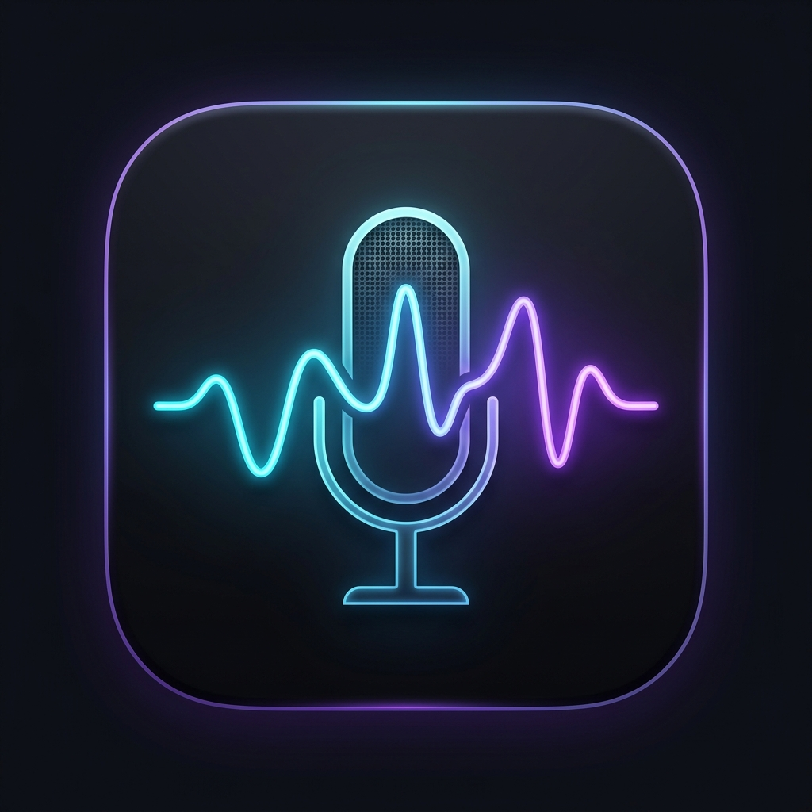
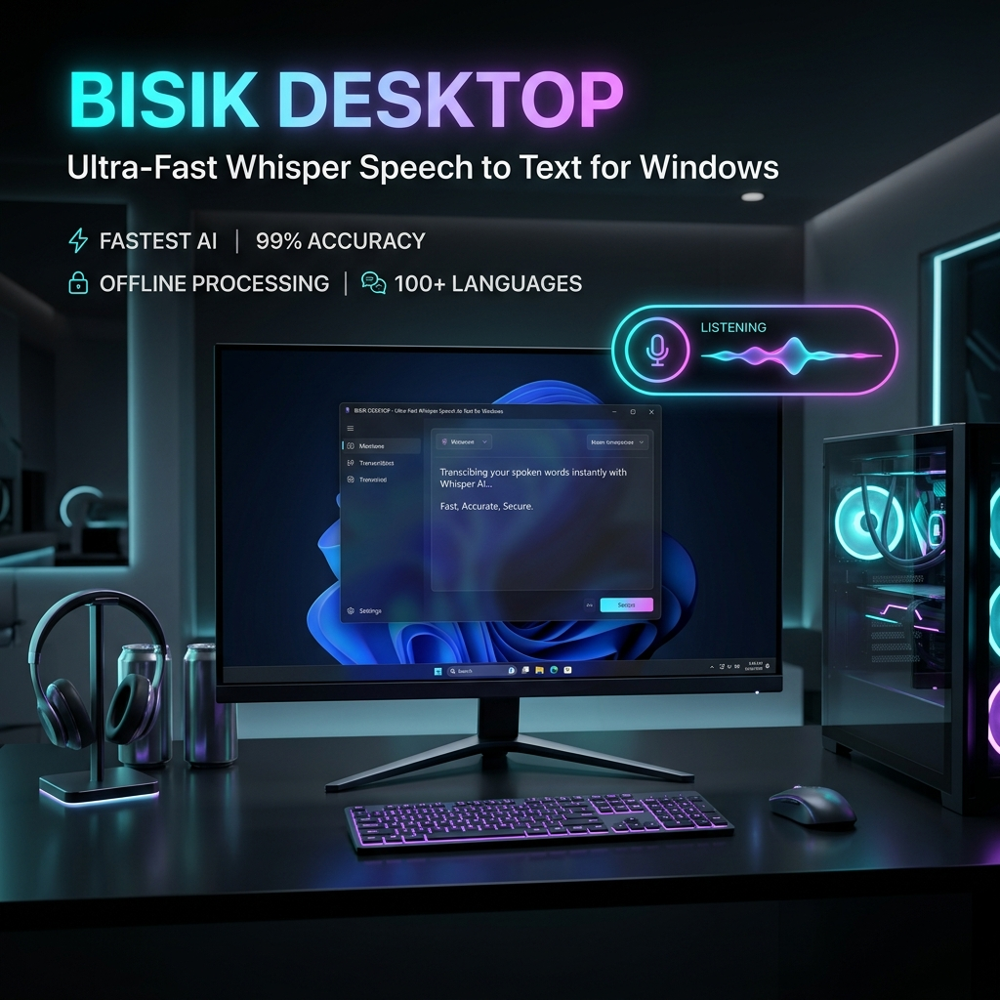
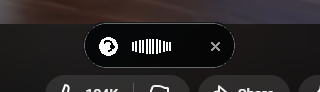
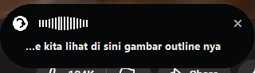

<div align="center">



# Bisik Desktop

**Ultra-Fast Whisper Speech-to-Text for Windows**

<p align="center">
  
  
  
  
  
  
</p>

<p align="center">
  Dynamic Island floating mic widget powered by Groq LPU Whisper with zero-disk I/O, dual-model auto-fallback, and instant auto-paste across any Windows app.
</p>

[⬇️ **Download Bisik for Windows (v1.0.0)**](https://github.com/lordbarry21/bisik-desktop/releases/download/v1.0.0/Bisik-v1.0.0-Windows.zip) &nbsp;•&nbsp; [✨ Fitur Utama](#-fitur-utama) &nbsp;•&nbsp; [⌨️ Pintasan Keyboard](#️-pintasan-keyboard--kontrol) &nbsp;•&nbsp; [🏗️ Arsitektur](#️-arsitektur--cara-kerja)

---



</div>

---

## ⚡ Overview

**Bisik Desktop** adalah aplikasi Speech-to-Text ultra-cepat untuk Windows yang didesain dengan konsep **Dynamic Island floating widget**. Cukup tekan shortcut `Win + O` atau klik bubble mikrofon, bicara, dan hasil transkripsi akurat dari **Whisper Large v3** akan langsung tertempel otomatis (*auto-paste*) ke aplikasi apa pun yang sedang aktif tanpa mengganggu fokus jendela Anda.

Seluruh proses audio berjalan **100% in-memory (Zero-Disk I/O)** untuk kecepatan maksimum dan menjaga keawetan SSD.

---

## ✨ Fitur Utama

- **🏝️ Dynamic Island Recording Pill:** Tampilan minimalis modern tanpa teks yang mengganggu. Menampilkan visualizer gelombang suara real-time dan timer durasi yang responsif.
- **🎙️ Floating Mic Bubble:** Icon mic bulat minimalis (44px) yang selalu melayang di layar (*always-on-top*). Klik untuk mulai merekam, klik lagi untuk selesai dan langsung paste teks. Posisi dapat di-drag bebas ke sudut mana pun.
- **⚡ Zero-Disk I/O & Ultra Cepat:** Audio direkam langsung ke RAM buffer tanpa membuat file temporary di SSD/HDD. Transkripsi selesai dalam hitungan ratusan milidetik via Groq LPU.
- **🛡️ Dual-Model Auto-Fallback:** Menggunakan `whisper-large-v3` untuk akurasi tertinggi, dan otomatis fallback ke `whisper-large-v3-turbo` jika model utama sibuk atau terkena rate limit.
- **📋 Universal Auto-Paste:** Otomatis menginjeksikan teks hasil transkripsi via simulasi keyboard Win32 langsung ke aplikasi aktif (VS Code, Chrome, Word, Slack, Terminal, Notion, Discord) tanpa kehilangan window focus.
- **🌐 Glassmorphic Language Switcher:** Selector bahasa minimalis bergaya glassmorphism (*rounded 14px*). Mendukung **Auto Detect**, **Bahasa Indonesia (ID)**, dan **English (EN)**.
- **📜 Local Transcript History:** Riwayat transkripsi tersimpan rapi secara lokal di `%LOCALAPPDATA%\Bisik\transcripts.txt` untuk referensi cepat.

---

## 🖼️ Tampilan Widget

<div align="center">
  <table>
    <tr>
      <td align="center">
        <b>Bubble Mic Standby (Compact)</b><br/><br/>
        
      </td>
      <td align="center">
        <b>Recording Pill (Dynamic Island)</b><br/><br/>
        
      </td>
    </tr>
  </table>
</div>

---

## 🚀 Download & Quick Start

1. **Unduh installer/portable zip:**  
   👉 [**Bisik-v1.0.0-Windows.zip**](https://github.com/lordbarry21/bisik-desktop/releases/download/v1.0.0/Bisik-v1.0.0-Windows.zip)
2. **Ekstrak** file `.zip` ke folder pilihan Anda (misalnya `C:\Program Files\Bisik` atau folder Tools Anda).
3. Jalankan **`Bisik.exe`**.
4. Bubble mic melayang akan muncul di layar desktop dan icon tray aktif di taskbar pojok kanan bawah.
5. Tekan **`Win + O`**, ucapkan kalimat Anda, tekan **`Win + O`** lagi — teks langsung tertulis di kursor Anda!

---

## ⌨️ Pintasan Keyboard & Kontrol

| Kontrol | Aksi | Keterangan |
| :--- | :--- | :--- |
| <kbd>Win</kbd> + <kbd>O</kbd> | **Toggle Record / Transcribe** | Mulai merekam, atau stop dan langsung auto-paste |
| **Klik Kiri Mic** | **Toggle Record / Transcribe** | Kontrol manual via mouse |
| **Drag & Drop Mic** | **Pindahkan Posisi** | Geser icon ke posisi yang nyaman di monitor |
| **Klik Kanan Mic** | **Context Menu** | Retry rekaman terakhir, buka histori teks, toggle startup, exit |

---

## 🏗️ Arsitektur & Cara Kerja

```
[ Mikrofon ]
     │
     ▼ (Zero-Disk I/O: RAM Buffer)
[ PyAudio in Memory ]
     │
     ▼ (Serverless Proxy / Direct)
[ Groq LPU Whisper Large v3 ] ──(fallback jika sibuk)──> [ Whisper Large v3 Turbo ]
     │
     ▼ (Sub-500ms JSON Response)
[ Win32 Keystroke Injector ]
     │
     ▼ (Auto Ctrl+V)
[ Target App: VS Code / Browser / Word / Terminal ]
```

---

## 💻 Spesifikasi Teknis

- **Core Engine:** Python 3.11 + PySide6 (Qt)
- **Audio Capture:** PyAudio / SoundDevice (RAM buffer, 16kHz mono WAV)
- **Inference Engine:** Groq Cloud LPU (`whisper-large-v3` & `whisper-large-v3-turbo`)
- **Integration:** Windows Win32 API (`ctypes`, `RegisterHotKey`, `SendInput`)
- **Compatibility:** Windows 10 & Windows 11 (64-bit)

---

## 🔒 Privasi & Keamanan

- **Zero Persistence Audio:** Audio Anda hanya berada di RAM selama tombol rekam aktif dan langsung dihapus setelah diproses. Tidak ada file `.wav` tersisa di drive.
- **Koneksi Terenkripsi:** Audio dikirim via HTTPS TLS 1.3 langsung ke endpoint transkripsi terpercaya.
- **Histori Tersimpan Lokal:** Log transkripsi teks hanya disimpan di PC Anda (`%LOCALAPPDATA%\Bisik\transcripts.txt`).

---

<div align="center">
  <sub>Built with precision by <b><a href="https://github.com/lordbarry21">Bari Hartanto (@lordbarry21)</a></b></sub>
</div>
